# RecallStack — User Guide

A portable Tauri 2 desktop Personal Knowledge Management (PKM) app for notes, tasks, and journaling. Markdown remains in the workspace you select; no installation is required on Windows, Linux, or macOS.

Current application version: **2.0**.

---

## Getting Started

### Workspace Structure

Your workspace root must contain:

```
workspace-root/
├── Data/
│   └── [workspace-name]/
│       ├── tasks/          ← one workspace-level task folder
│       │   └── working/    ← active working tasks
│       ├── dailylogs/      ← one workspace-level daily journal folder
│       │   └── YYYY/MM/    ← daily journal entries
│       ├── [folder]/       ← regular note folders
│       │   ├── assets/     ← images & attachments
│       │   └── archived/   ← archived notes
│       └── ...
└── DB/
    └── index.db            ← search index (SQLite)
```

### Extra Data Folder

**Settings → Extra Data Folder** points RecallStack at any directory on disk outside the workspace `Data/` tree. It appears in the workspace switcher **after the `Data/` workspaces, immediately before the `sys` workspace** (or last, when no System folder is set), and works like one: its subfolders are Nav Row 1, its sub-subfolders are Nav Row 2, and browsing, opening, editing, creating, renaming, moving, archiving, and deleting all behave normally (deletes go to the OS trash). Its `assets/` images render in the preview. The choice persists across sessions and workspace switches. **Clear** removes it and switches back to a `Data/` workspace.

**Limitations**

- **Not indexed.** Its notes do not appear in workspace search, the calendar, backlinks, or `[[wikilink]]` completion — those stay scoped to the `Data/` workspaces.
- **No tasks.** The Task and Working Task icons are hidden while it is the active workspace; `tasks/` is never created inside your folder. The **Daily Journal works normally** — it is the shared journal under `Data/dailylogs/`.
- **Name.** The switcher label is the folder's own name. If it matches a `Data/` workspace name, both chips carry that name.
- **Browser build only:** the chosen folder is not remembered across page reloads (the File System Access API can't persist a directory handle) — the same as the Outputs folder. The desktop app remembers it via its path.

### System Folder

**Settings → System folder** points RecallStack at the one directory on disk that contains the managed system folders — `ai-team`, `openbrain`, `ai-team-shared`, and `openbrain-shared`. (This replaces the old **System Folders** show/hide tile; RecallStack no longer looks for those folders in the workspace root.)

When a System folder is set, a **`sys` workspace appears last** in the workspace switcher. Its top-level folders (Nav Row 1) are whichever of the four managed folders actually exist inside it. Like the Extra Data Folder, every read/write routes through the external filesystem bridge, so browse / open / edit / create / rename / move / archive / delete all work.

**Limitations**

- **Not indexed.** Its notes stay out of workspace search, the calendar, backlinks, and `[[wikilink]]` completion.
- **No tasks.** Task and Working Task icons are hidden; the **Daily Journal works** (the shared `Data/dailylogs/` journal).
- **Entered by click.** RecallStack never auto-selects `sys` on startup, but it is remembered as your last workspace like any other.
- **Path persistence.** The desktop app remembers the System folder across restarts; the browser build keeps it only for the current session.
- A bare `ai-team/…` or `openbrain/…` link in a note resolves inside the `sys` workspace.

### Workspace Outputs Folder

The Outputs icon beside workspace refresh opens the configured Outputs folder. Configure the path from **Settings**. If no path is set, RecallStack defaults to `<workspace path>/openbrain/outputs` using the platform's native path handling and creates the folder automatically when needed. The **Settings** dialog is a fixed-height, two-column layout: the tile grid and the four path panels — **Extra Data Folder**, **Outputs folder**, **External theme file**, and **System folder** — stack in the left column, and the **Theme** list fills the full height of the right column.

### Opening a Workspace

Click **Open Workspace** and select your root folder. The app remembers your last workspace and offers a **Reopen** button on future visits.

### Essential Keyboard Launchers

These shortcuts are available throughout the main application:

| Shortcut | Opens |
|---|---|
| **Ctrl + K** | **Keyboard Shortcuts** — the full keybinding reference sheet |
| **Ctrl + P** | **Command Palette** — find and run application commands, search notes and tags, open help |
| **Ctrl + Shift + T** | **Theme switcher** — arrow through themes with a live preview; Enter applies |
| **Ctrl + Space** | **Open Tabs selector** — switch between every currently open Note, Task, Working Task, Journal, or Output tab |
| **Ctrl + L** | **Notes listing** — the current folder's notes in a listing modal (with an *Archive* toggle); folder clicks open it too |
| **Ctrl + T** | **Task listing** — every workspace task, grouped by status and color-coded by priority, with **→ Working** / **Archive** per row |
| **Ctrl + W** | **Working Task listing** — `tasks/working/`, color-coded, with a **← Task** toggle per row |
| **Ctrl + J** | **Daily Journal** — open or focus today's journal note |
| **Ctrl + N** | **New file picker** — choose Note, Task, or Working Task (quick keys `n` / `t` / `w`) |

The listing modals, Open Tabs selector, and theme switcher all share the same keys: **J / ↓** and **K / ↑** to move, **Enter** to open, **Esc** to close, and a displayed letter code to jump. In the Open Tabs selector **X** closes the selected tab.

In the Open Tabs selector, use **J / ↓** to move down, **K / ↑** to move up, **Enter** to open the selection, **X** to close the selected tab, or type its displayed letter code to jump immediately. Press **Escape** to cancel without changing tabs.

---

## Building and Deploying RecallStack

Build from the RecallStack source directory. The release scripts use the version in `package.json`, verify that the Rust and Tauri versions match it, and write finished artifacts and SHA-256 checksums to `release/`.

### GitHub Actions reviewed builds

Open **Actions → Build reviewed release artifacts**, select **Run workflow** on
`master`, and start a new run. The manual workflow uses Node.js 24 and builds the
Windows portable, Linux, and macOS artifacts independently. Download
`recallstack-windows-portable`, `recallstack-linux`, or `recallstack-macos` from
the successful run's **Artifacts** section. After pushing a fix, start a new
workflow run instead of rerunning an older job, because a rerun continues to use
its original commit.

### Arch Linux

#### Build prerequisites

Install the native compiler toolchain, Tauri WebKit/GTK dependencies, AppImage support, Node.js with npm, and the stable Rust toolchain. On Arch Linux:

```bash
sudo pacman -S --needed base-devel nodejs npm gtk3 webkit2gtk-4.1 libayatana-appindicator librsvg patchelf fuse2 rustup
rustup default stable
```

RecallStack's reviewed release workflow uses Node.js 24. After cloning or copying the source tree, install the locked JavaScript dependencies:

```bash
cd /path/to/RecallStack
npm ci
```

#### Verify and build

```bash
npm run release:verify
npm run release:clean
npm run build:linux
npm run package:linux:tar
npm run build:linux:appimage
npm run package:linux:appimage
```

The `release/` directory will contain:

- `RecallStack-<version>-linux-x86_64.tar.gz` — portable Linux archive
- `RecallStack-<version>-linux-x86_64.AppImage` — single-file Linux application
- `PKGBUILD` — Arch package recipe pinned to the generated tarball checksum
- `.sha256` files and `artifact-manifest.json` — integrity information

#### Deploy the portable tarball

Extract the archive somewhere writable and run the executable directly:

```bash
tar -xzf release/RecallStack-*-linux-x86_64.tar.gz
cd RecallStack-*/
./recallstack
```

Keep `readme.md`, `changes.md`, `builtin-themes.json`, and `theme.json` beside `recallstack`. The archive also includes a desktop entry and application icon under `share/`; these can be copied to the equivalent paths below `~/.local/share/` if desktop-menu integration is wanted.

#### Install as an Arch package

Keep the generated `PKGBUILD` and its matching tarball together in `release/`, then build and install it as a normal user:

```bash
cd release
makepkg -si
```

This installs the executable as `/usr/bin/recallstack` and installs its desktop entry, icon, and license through pacman. Use `pacman -R recallstack-bin` to remove that package later.

#### Run the AppImage

```bash
chmod +x release/RecallStack-*-linux-x86_64.AppImage
./release/RecallStack-*-linux-x86_64.AppImage
```

The AppImage does not require a package installation. `fuse2` may be required to launch it on Arch Linux.

### Windows Portable

Windows artifacts should be built natively on 64-bit Windows 10 or Windows 11. The supported build uses the MSVC toolchain; building the Windows release from Arch Linux is not part of the reviewed release process.

#### Build prerequisites

Install:

- Node.js 24 with npm
- Rust stable using `rustup` with the `x86_64-pc-windows-msvc` target
- Visual Studio 2022 Build Tools with **Desktop development with C++**, MSVC v143, and a Windows 10 or 11 SDK
- Microsoft Edge WebView2 Evergreen Runtime for launching and testing RecallStack

In PowerShell, prepare the toolchain and dependencies:

```powershell
rustup default stable
rustup target add x86_64-pc-windows-msvc
cd C:\path\to\RecallStack
npm ci
```

#### Verify, build, and package

```powershell
npm run release:verify
npm run release:clean
npm run build:windows:portable
npm run package:windows:portable
```

The `release\` directory will contain:

- `RecallStack-<version>-windows-x86_64-portable.exe` — raw portable executable
- `RecallStack-<version>-windows-x86_64-portable.zip` — recommended complete portable package
- `.sha256` files and `artifact-manifest.json` — integrity information

No MSI, setup program, Windows service, registry installation, shortcut, or uninstaller is created.

#### Deploy on Windows

Copy the portable ZIP to the destination computer, extract the entire ZIP into a writable folder, and keep these files together:

```text
RecallStack.exe
README.txt
LICENSE
readme.md
changes.md
builtin-themes.json
theme.json
```

Run `RecallStack.exe`; administrator access is not required. If the application does not open, install or repair the Microsoft Edge WebView2 Evergreen Runtime. Unsigned local builds may display a Windows SmartScreen warning.

To deploy an update, close RecallStack and replace the extracted application files with the new release. Workspace Markdown and `DB/index.db` remain in the user-selected workspace and are not stored beside the executable.

### macOS

macOS artifacts must be built natively on a Mac; building the macOS release from Windows or Arch Linux is not part of the reviewed release process.

#### Build prerequisites

Install:

- Node.js 24 with npm
- Rust stable using `rustup` with both the `aarch64-apple-darwin` and `x86_64-apple-darwin` targets, so a single universal binary covers Apple Silicon and Intel

```bash
rustup default stable
rustup target add aarch64-apple-darwin x86_64-apple-darwin
cd /path/to/RecallStack
npm ci
```

#### Verify, build, and package

```bash
npm run release:verify
npm run release:clean
npm run build:macos:app
npm run package:macos:app
```

The `release/` directory will contain:

- `RecallStack-<version>-macos-universal.zip` — portable macOS package containing `RecallStack.app`

No DMG, PKG installer, or notarization is produced.

#### Deploy on macOS

Copy the ZIP to the destination Mac, extract it into a writable folder, and keep these files together:

```text
RecallStack.app
README.txt
LICENSE
readme.md
changes.md
builtin-themes.json
theme.json
```

Because RecallStack.app is unsigned and unnotarized, Gatekeeper blocks the first launch. Right-click (or Control-click) `RecallStack.app`, choose **Open**, and confirm **Open** again — or run `xattr -cr RecallStack.app` in Terminal first. No administrator access or separate WebView runtime is required; RecallStack uses the WebKit engine built into macOS.

To deploy an update, close RecallStack and replace `RecallStack.app` with the new release. Workspace Markdown and `DB/index.db` remain in the user-selected workspace.

### Release smoke test

Before distributing any platform build, test opening a workspace, opening and saving notes, native search and reindexing, backup creation, application close/reopen, and paths containing spaces or non-ASCII characters. Test the Windows ZIP from a non-administrator account, test Linux under the display environments that will be supported, and test the macOS ZIP on both Apple Silicon and Intel (or under Rosetta), including the Gatekeeper right-click-Open and `xattr -cr` paths on a freshly downloaded, quarantined copy.

### Release performance timing

Windows and Linux release builds include a repeatable, private-data-free timing run. It creates a temporary workspace containing 1,003 synthetic Markdown notes, launches the optimized application binary, and measures shell readiness, warm workspace opening, first-note opening, and recursive Outputs navigation:

```bash
npm run test:release:performance
```

Results are written to `performance-results/windows.json` or `performance-results/linux.json`. The reviewed GitHub Actions workflow runs this command on native Windows and Linux runners and includes the JSON result with each platform artifact. The timing run enforces generous regression ceilings while preserving the measured values for comparison between releases.

---

## Top Bar

| Control | Description |
|---|---|
| Pencil icon (app title) | Click to rename the app title — saved in your local application preferences |
| Workspace chips | Switch between multiple workspaces; each has its own theme |
| Refresh icon | Reload workspace folders and files |
| Outputs icon | Open the configured Outputs folder; the old top-level Outputs text button has been removed |
| Calendar icon | Toggle calendar view |
| Search box | Native full-text and structured search; hover for the supported filter list. Search results support `J/K`, arrow keys, `Enter`, `Escape`, and displayed one- or two-letter jump codes |
| Settings icon | Opens layout/navigation preferences: the tile grid, theme selector, and the Extra Data Folder, Outputs folder, External theme file, and System folder path pickers |
| Theme list | Choose from the built-in themes plus any from an external theme file; also reachable with `Ctrl+Shift+T` as a live-preview switcher |
| Folder nav mode icon | Toggle Nav Row 1 between **buttons** and **dropdown** display; persists per workspace |
| Subfolder nav mode icon | Toggle Nav Row 2 between **buttons** and **dropdown** display; persists per workspace |
| Word wrap icon | Toggle word wrap on/off in the editor; persists globally |
| Cursor position icon | Toggle where the cursor lands when opening a file — **First Line** (default) or **Last Line**; persists globally |
| Collapse icon | Toggle whether collapsible preview sections are **expanded** (default) or **collapsed** by default on render; persists globally. Also immediately opens/closes all collapsible sections in the current preview |
| Remote Images tile | Load `http(s)` images and media in the preview (**on** by default); turn off to block remote media for privacy. Persists globally |
| Book icon | Markdown syntax reference |
| Info icon | User guide |
| Clock icon | What's New — change log for this version of RecallStack |

---

## Library Status Bar

A compact **Libraries** bar appears along the bottom of the app after a workspace is open. It shows the load state for the JavaScript libraries RecallStack depends on:

- **Markdown** — markdown rendering
- **Syntax** — common syntax highlighting
- **Syntax+** — lazy-loaded extended syntax support
- **Diagrams** — Mermaid diagram rendering
- **SQLite** — native SQLite/index support

Each chip shows its source, such as **`(local)`** for bundled rendering
libraries or **`(native)`** for the Rust SQLite index:

- Green means the library is loaded and ready.
- Yellow means it is still loading.
- Blue means it is lazy-loaded and has not been needed yet.
- Red means the library failed to load.

Any dependency error message appears as plain text after the final chip, not inside a chip.

### Editor and Preview Zoom

The right side of the footer contains an **Editor/Preview zoom** dropdown for
screen sharing and high-resolution displays. **Default (100%)** restores the
normal content size. The remaining choices increase the Markdown editor text
and everything rendered inside Preview in 10% increments, up to **+100%
(200%)**. Images, Mermaid diagrams, tables, and code blocks scale with preview
text. Pane headers, toolbars, navigation, Working Tasks, and other application
controls do not scale. Preview content always follows the current pane width, so
paragraphs, code blocks, tables, images, and Mermaid diagrams reflow when a pane
divider moves. The selected zoom is saved globally and restored the next time
RecallStack starts.

### SQLite Source

The desktop application uses native Rust/SQLite FTS5 indexing. The status chip
displays **native**. The retired browser WebAssembly index and its source toggle
are no longer included.

---

## Navigation

### Nav Row 1 — Top-Level Folders

Shows folders inside `Data/[workspace]/`.

| Control | Action |
|---|---|
| **+** | Create a new top-level folder |
| Pencil icon | Rename the currently selected folder; disabled when none is selected |
| Daily Journal icon *(colored)* | Open or focus today’s pinned Daily Journal tab (`Ctrl+J`) |
| Task listing icon | Open the Task listing modal (`Ctrl+T`) |
| Working Task listing icon *(colored)* | Open the Working Task listing modal (`Ctrl+W`) |
| Folder / subfolder buttons | Select the folder and open its Notes listing modal (`Ctrl+L` reopens it) |
| Folder buttons *(default)* | Select a folder; one button per folder |
| Folder dropdown *(combo mode)* | Single dropdown spanning the full row; switch folders by selecting from it |

Switch between modes with the **Folder nav mode** icon in the top bar. The choice is remembered per workspace.

### Nav Row 2 — Subfolders

Appears after selecting a top-level folder.

| Control | Action |
|---|---|
| **+** | Create a subfolder |
| Pencil icon | Rename the currently selected subfolder; disabled when none is selected |
| Archive icon | Toggle archive mode — shows the `archived/` subfolder |
| Broken-link icon | Find orphaned assets (unreferenced files in `assets/`) |
| **root** button | Shows markdown files directly inside the selected top-level folder, not inside any subfolder |
| Subfolder buttons *(default)* | One button per regular subfolder |
| Subfolder dropdown *(combo mode)* | Single dropdown for regular subfolders |

Switch between modes with the **Subfolder nav mode** icon in the top bar. The choice is remembered per workspace.

The special **root** button is shown for every top-level folder. It is not a real subfolder; it represents files saved directly in the selected top-level folder. New notes created while **root** is selected are saved directly there. Root notes cannot be archived, so the archive controls are hidden while root is active.

Workspace-level `tasks/` and `dailylogs/` are system folders. They are managed by the Tasks and Daily Journal icon buttons instead of Nav Row 2.

#### Rename Behaviour

- Renaming saves any currently open file first, performs one native atomic folder rename, then reloads the file at its new path. Folder contents no longer pass through the WebView during this operation.
- If no file is open, the file list refreshes automatically after the rename.

---

## File List

### Note Cards

Each card shows: file name · last modified time · `.md` extension. Click to open in the editor.

### Task Cards

Files inside a `tasks/` folder display extra metadata:

| Indicator | Meaning |
|---|---|
| ↑↑ red | High priority |
| ● blue | Normal priority |
| ↓↓ green | Low priority |
| Ø gray | Blocked |
| \|\| yellow | On Hold |
| Completed date shown | Task is done |
| N days elapsed | Task is in progress (started) |
| Due date — cyan | More than 2 days away |
| Due date — pink | Due within 2 days |
| Due date — red bold | Overdue |

### List Controls (top-right)

| Button | Action |
|---|---|
| ✓ | Show / hide completed tasks *(tasks folder only)* |
| Clock | Sort by last modified — newest first |
| A→Z | Sort alphabetically |
| **+** | Open the filename prompt for a new note or task in the current context. In the Tasks list view or Daily Journal, it creates a normal task markdown file in `tasks/` |

The filename prompt is 60% of the current application width and selects the generated dated title automatically without showing `.md`. Press **Enter** to create that default file immediately, begin typing to replace the selection with a custom title and then press **Enter**, or press **Escape** to cancel without creating anything. RecallStack adds `.md` during creation and prevents collisions with existing files. New Task and Working Task files also receive their full default metadata suffix during creation.

---

## Search Results

Workspace search results are keyboard-friendly:

| Key | Action |
|---|---|
| `J` / `↓` | Move to the next result |
| `K` / `↑` | Move to the previous result |
| `Enter` | Open the selected result |
| `Escape` | Exit search results and return to the previous view |
| Displayed one- or two-letter code | Jump directly to that result, using the same instant code system as the tab/task switchers |

Search results also mark notes already open in tabs. Focusing the search box restores the last buffered result set when one exists.

---

## Editor

### Auto-Save

RecallStack saves your work automatically — in most situations you never need to think about it.

| Trigger | What happens |
|---|---|
| Stop typing for 1.5 seconds | Silent background save; button briefly flashes "Saving…" |
| Switch to a different file | Current file saved before the new one opens |
| Minimise the window, switch applications, or lock the screen | Immediate save |
| Every keystroke | Draft written to local application storage as a crash buffer — survives a force-quit or application crash. On next open you'll be offered a restore prompt |

**When you do need to hit Save manually:**
- **New file content** — the filename prompt creates and saves the empty Markdown file immediately. After adding content, hit Save (or `Ctrl+S`) when you do not want to wait for auto-save.
- **Title change** — because the title is the filename, changing it is a rename operation that needs explicit confirmation via Save.

**New-file prompt cancellation** — pressing **Escape** while the filename prompt is open closes it without creating a file. Once created, the empty file is already saved and subsequent editor changes follow normal auto-save behavior.

---

### Toolbar Buttons

| Button | Shortcut | Action |
|---|---|---|
| Title field | — | Sets the filename (without `.md`). **Requires Save to apply a rename** |
| Copy MD icon | — | Copy raw markdown to clipboard |
| Copy HTML icon | — | Copy rendered HTML to clipboard (collapsible sections expanded) |
| Link icon | — | Copy the selected markdown file's full filesystem path as inline code, e.g. `` `/home/scdev/notes/Data/personal/example.md` `` |
| Book/link icon | — | Copy a RecallStack markdown link to the selected file. Paste it into another note; when rendered in RecallStack preview, clicking it opens that file inside the app |
| **Save** | `Ctrl+S` | Save current content immediately. Required for title changes; otherwise auto-save handles content updates |
| Task icon | — | Convert note → task (moves to `tasks/` folder) |
| Copy icon | — | Save, then duplicate the current file as `Name (2)`, incrementing the number when needed |
| Move icon | — | Move file to a different folder or to a top-level folder **root** destination |
| Archive icon | — | Move file to `archived/` subfolder; hidden for root-level notes |
| Restore icon | — | Move archived file back to active folder |
| Trash icon | — | Send the file to the OS trash (Recycle Bin / Trash / freedesktop Trash) |
| **Cancel** | `Esc` | Exit editor; discards new unsaved notes silently |
| **+ New** *(editor)* | — | Save the current file, then open the filename prompt for a new note or task in the active subfolder or active **root** |
| Presentation icon | — | Enter full-screen presentation mode (Escape to exit) |

> **Word wrap** has moved to the top bar and now applies globally across sessions.

> When editing a **Working Task**, the stamp-date, convert, copy, move, archive/restore, and delete controls are hidden. Use the **WORKING** indicator to return the task to the main Tasks list.

### Task Date Bar

Visible when editing a file in a `tasks/` folder. Provides date pickers and a priority dropdown. Task metadata is stored in the filename, so the task’s markdown body stays untouched:

| Field | Stored with the task |
|---|---|
| Start Date | Start-date filename metadata |
| Completed Date | Completion-date filename metadata |
| Due Date | Due-date filename metadata |
| Priority | Priority filename metadata |

The small calendar-action button beside **Start Date** or **Completed Date** marks that field with today’s date immediately, without opening the date picker. Marking a task completed also adds today as its Start Date when no start date has been set yet.

Priority and Status controls are borderless until selected; the selected option is outlined to make the active choice clear.

### Editor and preview

A note opens showing only the rendered **Preview** (full width). Behind it is a CodeMirror 6 source editor with Markdown highlighting, folding, undo/redo history, line numbers, current-line highlighting, a subtle current-line text glow, a glowing caret, and note/tag completion.

- Press **`I`** (as in *insert*) to switch to editing — the Markdown pane takes over full width.
- **Click a spot in the preview** before pressing `I` and the caret lands on that source line (scrolled into view). The clicked block gets a soft highlight showing where the caret will go; it clears on the next render, keystroke, or mode switch. Clicks inside a fenced code block map to the line within the fence, and clicks on links, `<details>` toggles, or checkboxes still do their normal thing.
- Press **`Esc`** while editing to return to the preview; it re-renders once with your latest changes.
- A new, empty note opens straight in editing so you can start typing.
- Each tab remembers whether you left it in edit or preview mode and reopens that way; switching tabs no longer forces a tab back to preview.
- While you are editing, the preview is **not** re-rendered on every keystroke — this keeps typing fast in large notes. It catches up the moment you press `Esc`.
- Pressing the **Presentation** button while editing first drops you back to a fresh preview, then starts the presentation.

---

## Tabs

RecallStack keeps a single shared editor and preview pane, but a **tab strip** above the editor toolbar lets you keep several files open at once and switch between them without losing your place.

- Each open file gets a tab showing its title (long titles are truncated with an ellipsis) and a **×** close button
- A small dot appears on a tab with unsaved changes
- Click a tab to activate it — the shared editor and preview swap to that file
- The active tab's title is bold and uses a contrast-adjusted theme accent so it remains distinct in light and dark themes
- Click a tab's **×** to close it
- Opening a file that is already open in a tab activates that tab instead of opening a duplicate
- Drag a tab and drop it onto another tab to reorder the strip; a highlighted edge on the target tab shows which side the dragged tab will land on
- When there are more open tabs than fit in the window, the strip scrolls horizontally

### Quick Open Tab Selector

Press **Ctrl+Space** from any main application view to open a list of every currently open tab. The current tab starts highlighted.

- Press **↓** or **J** to move down, **↑** or **K** to move up, and **Enter** to switch to the highlighted tab
- Press **X** to close the highlighted tab. The selector and visible tab bar refresh immediately and the selector stays open on a neighboring tab; it closes only after the final tab is closed
- Press **Escape** to close the selector without switching and restore whatever had focus before it opened
- Each tab has a compact one- or two-letter code. Type that code to switch immediately without pressing Enter; jump codes never contain **J**, **K**, or **X** because those letters are reserved for navigation and closing
- The list identifies Notes, Tasks, Working Tasks, Journals, and Outputs files and marks tabs with unsaved changes
- Press **Ctrl+Space** again to close the selector

### Current Limitations

- Tabs are workspace-scoped — closing or switching the workspace closes all tabs. Nothing is lost: the same autosave and unsaved-note protection that guarded a single open file runs first, exactly as it did before tabs existed
- Each tab preserves its edit/preview mode across switches, but undo history and preview rendering are still not tracked per tab — switching tabs does not preserve that tab's undo/redo stack or a cached render, and the preview is regenerated on activation
- Tab order and which tabs were open are not restored after restarting the app

---

## Command Palette

A keyboard-first launcher for commands, notes, tags, and quick help. It opens as a centered dialog with a single search input.

### Opening It

| Shortcut | Behavior |
|---|---|
| `Ctrl+P` (`Cmd+P` on macOS) | Toggle the palette — opens pre-filled with `>` (command-search mode) if it's closed, closes it if it's already open |

`Ctrl+K` is no longer a palette shortcut — it now opens the **Keyboard Shortcuts** reference sheet.

### Modes

The first character typed into the palette input switches what it searches. Each `Ctrl+P` press resets to command-search mode — modes are not remembered between sessions.

| Prefix | Mode | What it does |
|---|---|---|
| `>` *(default — no prefix also works)* | Commands | Fuzzy-searches every registered application command by title, category, and keywords |
| `@` | Notes | Quick-opens any indexed note by filename or path; selecting a result opens it in the editor |
| `#` | Tags | Lists every `#tag` found across indexed notes; selecting one runs a workspace search for that tag |
| `?` | Help | Shows a short static reference of the four modes and the navigation keys below — these entries are informational only and don't run anything |

### Navigation

| Key | Action |
|---|---|
| `↑` / `↓` | Move the highlighted selection |
| `Page Up` / `Page Down` | Jump the selection 8 items at a time |
| `Enter` | Run the highlighted item |
| `Escape` — **Back**, then **Close** | If a command is mid-way through picking an argument (see below), the first `Escape` cancels just that step and returns to the normal list; otherwise, or on a second `Escape`, it closes the palette |
| Click outside the dialog | Closes the palette |
| Mouse hover | Also updates the highlighted selection |

### Commands That Ask for an Argument

**Change Theme** and, on desktop builds, **Open Recent Workspace** don't run immediately on `Enter` — they replace the list with a second one scoped to that command (every theme, or every recent workspace) and keep the palette open until you pick from it.

### Registered Commands

Commands are shown or enabled based on context — most **File** and **Editor** commands need a note or workspace open, and **Tools** and some **Workspace** commands only appear in the native desktop build. A disabled command still appears in the list (greyed out), with the reason shown in place of its category.

#### File

| Command | Shortcut |
|---|---|
| Create Note, Task, or Working Task | `Ctrl+N` |
| Save Note | `Ctrl+S` |
| Move or Rename Note | — |
| Archive or Restore Note | — |
| Move Note to Trash | — |
| Close Tab | `Ctrl+Q` (also `Ctrl+Shift+W`) |
| Close Other Tabs | — |
| Reopen Closed Tab | — |

#### Navigation

| Command | Shortcut |
|---|---|
| Search Notes | `Ctrl+/`, `Ctrl+Shift+F`, `Ctrl+F` |
| Open Today Journal | `Ctrl+J` |
| Open Task quick selector | — |
| Show Task Listing | `Ctrl+T` |
| Show Working Task Listing | `Ctrl+W` |
| Toggle Presentation Mode | `F12` |
| Zoom In / Out / Reset | `Ctrl++`, `Ctrl+-`, `Ctrl+0` |
| Next Tab | `Ctrl+Tab` |
| Previous Tab | `Ctrl+Shift+Tab` |

#### Tasks

| Command | Shortcut |
|---|---|
| Create Working Task | — |
| Open Task quick selector | — |
| Show Task Listing | `Ctrl+T` |
| Show Working Task Listing | `Ctrl+W` |

#### View

| Command | Shortcut |
|---|---|
| Toggle Presentation Mode | — |
| Edit / Preview | `I` (edit) · `Esc` (preview) |
| Change Theme *(opens an argument list)* | — |
| Open Theme Switcher | `Ctrl+Shift+T` |
| Show Notes Listing | `Ctrl+L` |

#### Editor

| Command | Shortcut |
|---|---|
| Insert Markdown Link | — |
| Insert Code Block | — |
| Insert Mermaid Block | — |

#### Workspace

| Command | Shortcut |
|---|---|
| Open or Switch Workspace | — |
| Open Recent Workspace *(desktop, opens an argument list)* | — |
| Reveal Current File *(desktop)* | — |
| Reveal Workspace Folder *(desktop)* | — |
| Close RecallStack *(desktop)* | — |

#### Tools *(desktop only)*

| Command | Shortcut |
|---|---|
| Validate Workspace | — |
| Rebuild Search Index | — |
| Backup Workspace | — |
| Show Git Status | — |

> `Ctrl+1` through `Ctrl+9` jump directly to the tab in that visual position. This is a raw global shortcut, not a palette command, so it isn't listed in the table above — see **Keyboard Shortcuts → Global**.

---

## Listing Modals (Notes / Tasks / Working Tasks)

Note, task, and working-task browsing all happen in a centered listing modal
sized to 80% × 60% of the window, so the editor and preview stay visible behind
it:

- **Ctrl + T** — **Task listing** for the workspace `tasks/` folder.
- **Ctrl + W** — **Working Task listing** for `tasks/working/`.
- **Ctrl + L** — **Notes listing** for the currently selected folder. Clicking a
  folder or subfolder in the nav bar opens it automatically (Inbox and Outputs
  still use the inline list).

Every list uses the coded-jump navigation: arrow keys or **J / K** to move, a
displayed one- or two-letter code to jump instantly, **Enter** to open, **Ctrl +
Enter** to open pinned, **Esc** to close.

**Header controls**

- **Sort** button — toggles between **A–Z** and **Modified**. Each list
  remembers its own choice across restarts.
- **Show archived** button (Task and Notes listings) — switches the list to the
  `archived/` folder for that scope. Toggle it off to return to the live list.

**Grouping & color**

- The **Task listing** is split into sections — **Tasks**, **Completed**, **In
  QA Review**, **Marked for Deployment**, **Deployed**, **Backlog / Deferred** —
  and every task row is color-coded by priority (High / Normal / Low / Blocked /
  On hold). The Working Task listing is one flat, color-coded list.

**Row actions** (the trailing button on each row)

- **Task listing → Tasks section**: **→ Working** moves the task into
  `tasks/working/`.
- **Task listing → any status section**: **Archive** moves the task into
  `tasks/archived/`.
- **Working Task listing**: **← Task** returns the task to `tasks/`.
- **Notes listing**: **Archive** moves the note into that folder's `archived/`.
- **When showing archived**: every row's button is **Restore**, moving the file
  back out of `archived/`.

The affected row drops off the list immediately; the modal stays open until you
pick a file to view.

## Theme Switcher

**Ctrl + Shift + T** opens the theme switcher. Arrow up and down (or **J / K**)
to move through every theme — built-in and external — and the whole app
re-themes live as you move. **Enter** applies and remembers the theme for the
workspace; **Esc** reverts to the theme you started on. The Theme list in
**Settings** still works exactly as before.

## External Theme File

**Settings → External theme file** points RecallStack at a JSON file of extra
themes that are merged with the built-ins. The choice persists across restarts.
One file can define multiple themes; any theme whose `id` collides with a
built-in one is skipped. **Use sample themes** loads the bundled **Lupine** and
**Osaka Jade** example without picking a file. The format matches
`builtin-themes.json` — a `themes` array (or a bare array), each entry with
`id`, `name`, `group`, `mode` (`"light"` / `"dark"`), and a `variables` map of
the required `--base` … `--pink` six-digit hex colors. `docs/themes.md` has the
full schema.

## The Escape Key

`Esc` only *undoes a mode* — it never navigates:

- With a palette or any modal open, it closes that and returns you to the note
  or task you had selected.
- In presentation mode, it exits presentation.
- While editing a note, it returns to the preview.
- With nothing to exit, it does nothing. Press `Ctrl+J` to jump to today's
  Daily Journal.

When no note, task, or working task is open, RecallStack shows the Daily Journal
rather than an empty file list.

## Key Mapping

Press **Ctrl + K** at any time for this same reference inside the app. Letter
keys are case-insensitive.

### Global

| Shortcut | Action |
|---|---|
| `Esc` | Close any open palette or modal; exit presentation; return from editing to the preview. Otherwise does nothing. |
| `Ctrl+K` | Open the keyboard-shortcut reference sheet |
| `Ctrl+P` | Toggle the command palette (command-search `>` mode) |
| `Ctrl+Shift+T` | Open the theme switcher (live preview; Enter applies) |
| `Ctrl+I` | Open the Open / Import Files dialog |
| `Ctrl+S` | Save the current note, task, or working task *(while editing)* |

### Files & Tabs

| Shortcut | Action |
|---|---|
| `Ctrl+N` | New file picker — Note / Task / Working Task (`n` / `t` / `w`) |
| `Ctrl+Q` *(also `Ctrl+Shift+W`)* | Close the current tab |
| `Ctrl+Tab` / `Ctrl+Shift+Tab` | Next / previous tab |
| `Ctrl+1` – `Ctrl+9` | Jump to the tab in that visual position (1 = leftmost) |
| `Ctrl+Space` | Toggle the quick Open Tabs switcher |

### Navigation

| Shortcut | Action |
|---|---|
| `Ctrl+J` | Open or focus today's Daily Journal |
| `Ctrl+L` | Toggle the Notes listing modal for the current folder |
| `Ctrl+T` | Toggle the Task listing modal |
| `Ctrl+W` | Toggle the Working Task listing modal |
| `Ctrl+/` *(also `Ctrl+Shift+F`)* | Focus the workspace search box |
| `Ctrl+F` | Reopen buffered search results, or the quick search box |

### Views

| Shortcut | Action |
|---|---|
| `F12` | Toggle presentation mode |
| `Ctrl++` / `Ctrl+-` / `Ctrl+0` | Step content zoom up / down / reset to 100% |

### In the Title / Filename Field

| Shortcut | Action |
|---|---|
| `Enter` | Move focus to the markdown editor |
| `Tab` | Move focus to the markdown editor at line 1, character 1 |

### In the Markdown Editor

| Shortcut | Action |
|---|---|
| `Ctrl+Z` / `Ctrl+Shift+Z` | Undo / redo — up to 50 steps, including list, indent, delete-line and blockquote edits |
| `Enter` in a list | Continue list on next line with matching prefix |
| `Enter` on empty list item | Exit the list |
| `Tab` | Indent selected lines (or insert 2 spaces at cursor) |
| `Shift+Tab` | Outdent selected lines |
| `Ctrl+D` | Delete the current line |
| `Ctrl+'` | Toggle blockquote (`> `) on all selected lines |
| `Enter` *(nowrap mode)* | Scrolls the view back to the left margin |

### List Auto-Continuation

Press `Enter` at the end of a list item to auto-continue:

| Current line | Next line prefix |
|---|---|
| `- item` | `- ` |
| `* item` | `* ` |
| `1. item` | `2. ` |
| `[ ] item` | `[ ] ` |
| `[x] item` | `[ ] ` |

Press `Enter` on an **empty** list item to exit the list.

---

## Markdown Features

### Inline Formatting

| Syntax | Result |
|---|---|
| `**bold**` | **bold** |
| `*italic*` | *italic* |
| `~~strikethrough~~` | ~~strikethrough~~ |
| `` `inline code` `` | `inline code` |
| `[label](url)` | hyperlink |
| `[https://example.com]` | bracketed bare URL rendered as one clickable link |
| `` | image |

### Block Elements

- **Headings**: `# H1` through `###### H6`
- **Blockquotes**: `> text` (supports nesting with `>> nested`)
- **Horizontal rule**: `---`
- **Tables**: GitHub Flavored Markdown (GFM) style
- **Task lists**: `- [ ] todo` / `- [x] done`
- **Bare checkboxes**: `[ ] item` without a list prefix is also supported

### Collapsible Headings

Add matching `#` characters to **both ends** of a heading to make it collapsible in the preview:

```
#### Section Title ####
content under this section
##### nested heading — not collapsible, just a heading
more content
#### Next Section ####
```

- The collapsed content spans from the heading line to the next heading of the **same or higher level** (i.e. same or fewer `#` characters), or end of file
- Lower-level headings inside the content (e.g. a `#####` inside a `####` section) do **not** end the collapsible range unless they also use the symmetric syntax
- Collapsible sections nest: a `##### Inner #####` inside a `#### Outer ####` section folds within it
- The **collapse toggle icon** in the top bar sets whether sections start expanded or collapsed on every render; the setting persists globally
- **Copy HTML to clipboard** always copies collapsible sections as fully expanded regardless of their current state in the preview

### Fenced Code Blocks

````
```python
print("hello world")
```
````

- Language label shown in the top-left of the block
- **Copy button** in the top-right — click to copy to clipboard
- Syntax highlighting for 200+ languages

### Images

- Images constrained by pane width show an **open-in-new-tab button** on hover (top-right corner)
- Paste or drag-and-drop images directly into the editor to embed them automatically

---

## Mermaid Diagrams

Fenced code blocks with the language tag `mermaid` are rendered as live diagrams.

````

````

The following diagram types are supported:

---

### Flowchart

Directed graphs with boxes, diamonds, and arrows. Use `graph` or `flowchart` with a direction: `TD` (top-down), `LR` (left-right), `BT`, `RL`.

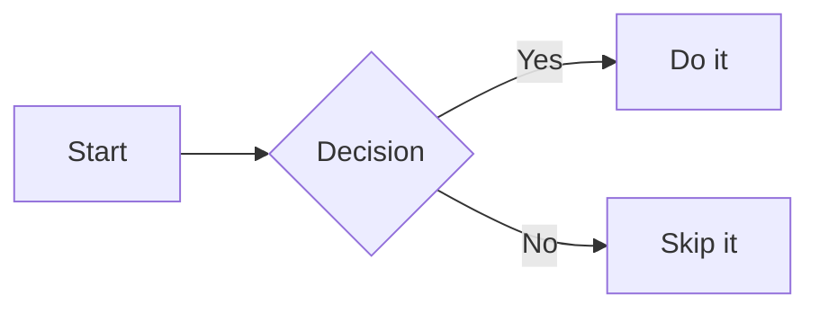

---

### Sequence Diagram

Shows interactions between actors over time — great for API flows, protocols, and call chains.

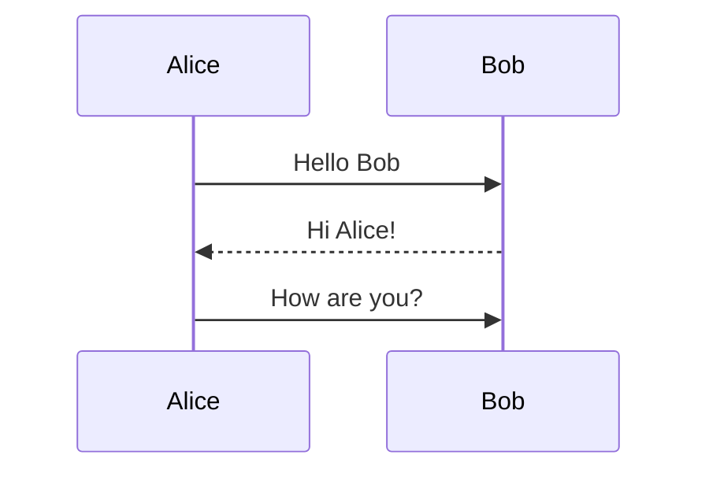

---

### Git Graph

Visualises a git branch and commit history.

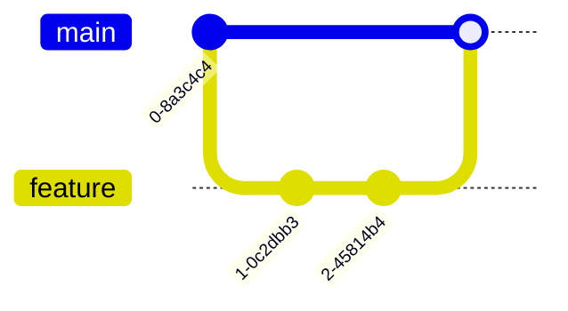

---

### Class Diagram

UML-style class relationships — inheritance, composition, associations.

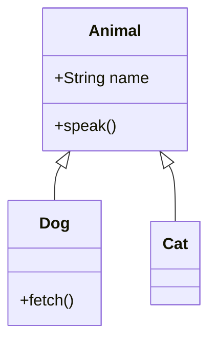

---

### State Diagram

Finite state machines and lifecycle flows.

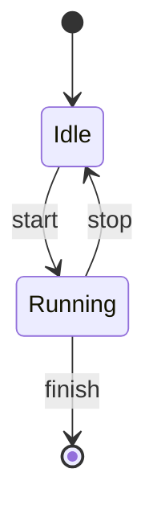

---

### Entity-Relationship Diagram

Database schema and entity relationships.

```mermaid
erDiagram
  USER ||--o{ ORDER : places
  ORDER ||--|{ LINE_ITEM : contains
  USER { string name, string email }
```

---

### Gantt Chart

Project timelines and schedules.

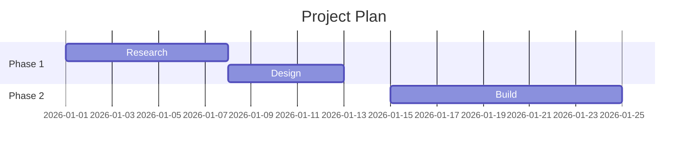

---

### Pie Chart

Simple proportional data.

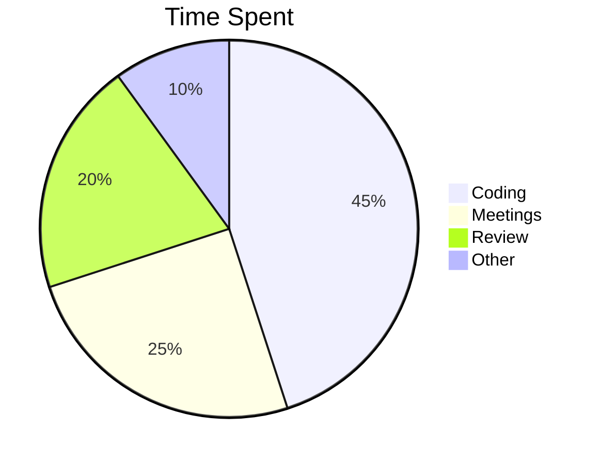

---

### User Journey

Maps steps in a user experience with satisfaction scores (1–5).

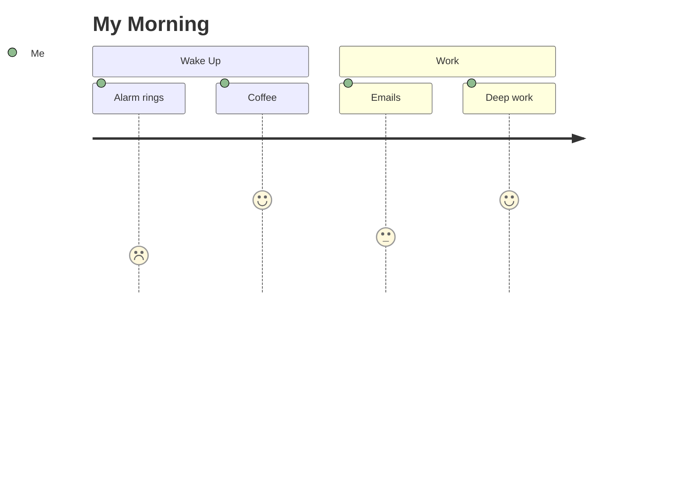

---

### Mindmap

Hierarchical tree of ideas radiating from a central topic.

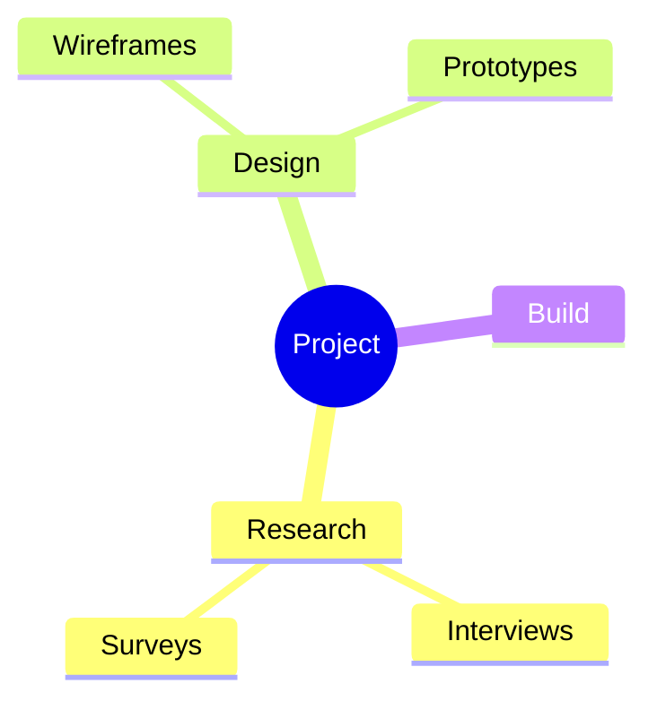

---

### Timeline

Chronological list of events by time period.

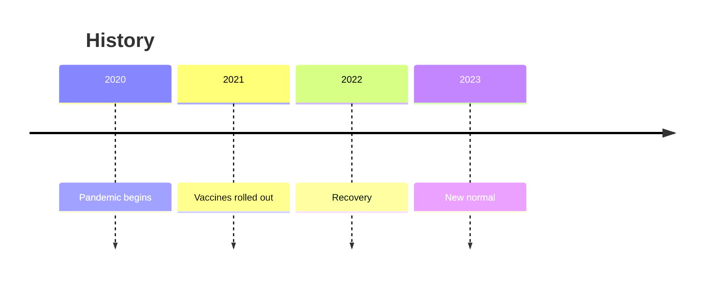

---

### C4 Diagram

Software architecture at different levels of abstraction (Context, Container, Component, Code).

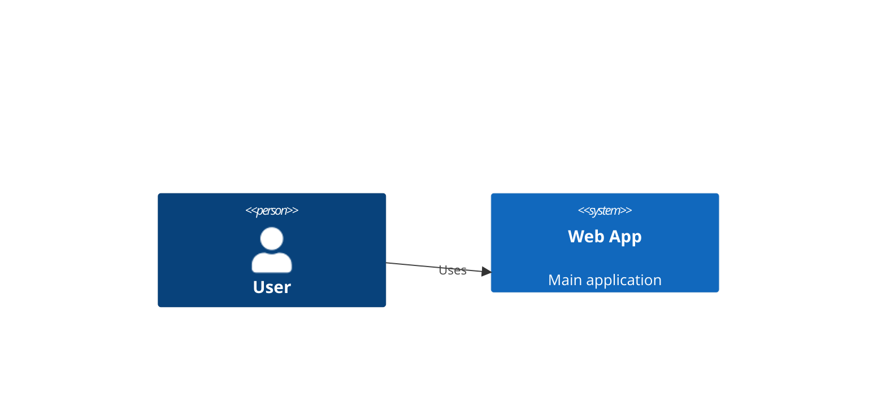

---

### Sankey Diagram *(beta)*

Flow volumes between nodes — energy, money, traffic.

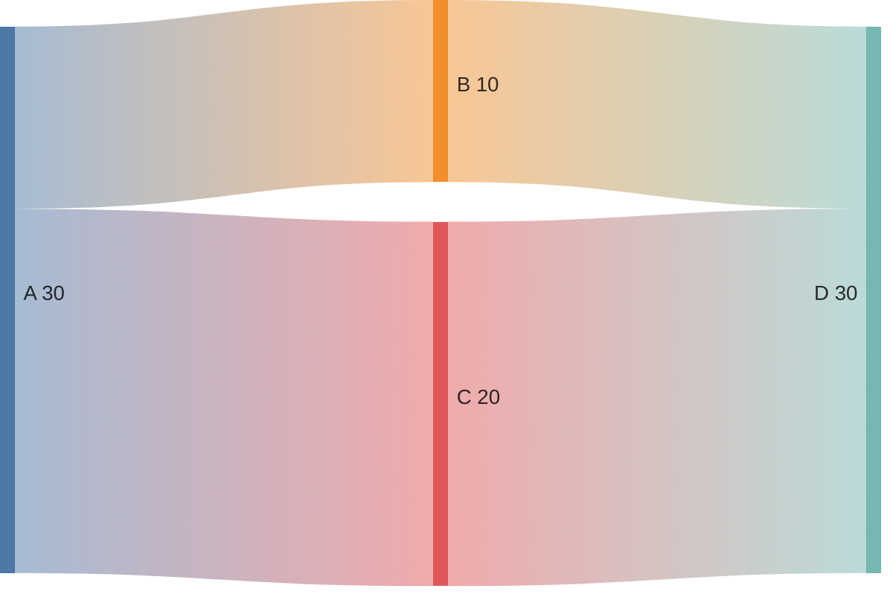

---

### XY Chart *(beta)*

Bar and line charts on an XY axis.

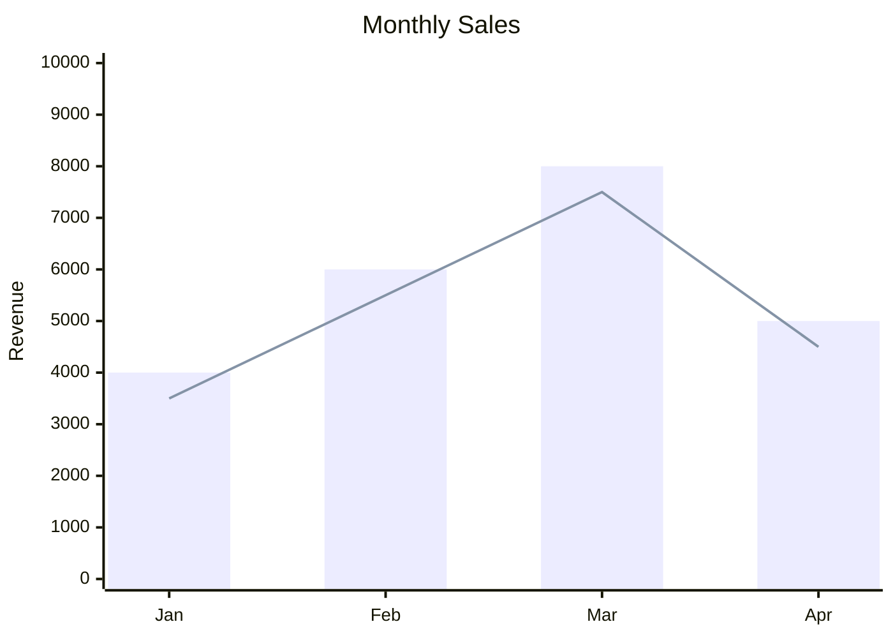

---

### Block Diagram *(beta)*

Flexible block-based layout for architecture and system diagrams.

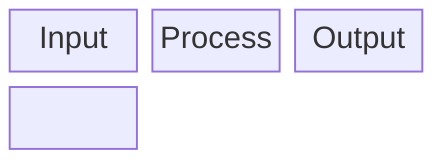

---

## Assets — Images & Attachments

Drag and drop or paste files directly into the editor:

- **Images** are saved and embedded as ``
- **Other files** are saved and linked as `[filename](assets/filename.pdf)`
- Files are stored in the `assets/` subfolder next to the note
- **Pasting an image works on every desktop build, including Linux.** WebKitGTK does not expose pasted images to the web `paste` event, so the Linux build reads the image off the OS clipboard directly (`wl-paste` / `xclip`) and saves it as a PNG in `assets/`

### Orphan Asset Cleanup

In Nav Row 2, click the **broken-link icon** to scan `assets/` for files not referenced in any note. You can preview images and delete unused files from there.

---

## Search

Type **3 or more characters** in the search box to search across all notes in the workspace. Results display as clickable file cards with a highlighted snippet showing where the match occurred. Press `Escape` to clear search and return to the previous view.

---

## Calendar

Click the **calendar icon** to open the calendar view. Tasks with a Start, Due, or Completed Date appear as colored dots.

| Dot color | Meaning |
|---|---|
| Green | Start Date |
| Lavender | Completed Date |
| Red | Due Date |

- **← Prev / Next →** — Navigate months
- **Today** — Jump to current month
- Click a **day cell** or **task dot** to see a panel listing all tasks for that day
- The first item in every selected-day panel is **Journal / Daily Log**; click it to open that day's journal, creating the saved entry when it does not yet exist
- Click a task in the panel to open it in the editor

### Calendar Filters

Toggle which dot types are shown with the checkboxes in the filter row: **Started**, **Completed**, **Due**.

---

## Archive

1. Open a note and click the **archive icon** in the editor toolbar → moves file to `archived/`
2. In Nav Row 2, click the **archive toggle** to browse archived files in the current folder
3. While viewing an archived file, click **Restore** in the toolbar to move it back to the active folder

Root-level notes are not archived. When **root** is selected, both the editor archive button and the Nav Row 2 archive toggle are hidden.

---

## Tasks

### Creating Tasks

- Click **+ New** in the Tasks list view, choose the selected dated filename or type a custom one, and press **Enter**, **or**
- Open any note and click the **task icon** in the toolbar to convert it (moves the file to `tasks/`)

### Task Metadata

Priority, start date, due date, and completion date are encoded in the task filename. The **Task Date Bar** manages that metadata through date pickers, quick today actions for Start and Completed Date, and priority/status controls; you do not need to edit the filename format yourself. Each date has a visible calendar button, and a clear (×) button appears whenever that date has a value. The RecallStack calendar closes when you choose a day and also provides **Today**, **Clear**, and **Close** actions.

### Working Tasks

Use a Working Task for an active task you want to keep separate from the main Tasks list.

- In a task editor, click the **TASK** indicator to move the task into `tasks/working/`. It becomes **WORKING**; click that indicator to return it to `tasks/`.
- Press **Ctrl + W** (or the colored Working Tasks button in Nav Row 1) for the **Working Task listing** modal — every working task, with a **← Task** button on each row to return it to `tasks/`.
- Create a Working Task from the **Ctrl + N** picker (choose *New Working Task*, or press `w`).
- Completing a Working Task automatically returns it to the main Tasks list.
- The Daily Journal control opens today’s journal entry at `dailylogs/YYYY/MM/`; a missing entry is created automatically and starts with the most recent journal content when available.
- The Daily Journal is kept as the first pinned tab for the current date and cannot be moved or closed.
- Journal filenames are derived from the daily-note date and are read-only in the editor. Journal Markdown content remains fully editable.

Working Tasks remain editable and savable, but cannot be stamped, converted, copied, moved, archived, restored, or deleted until returned to the main Tasks list.

### Task Listing

Click the **Task listing** icon in Nav Row 1, or press **Ctrl+T**, to see tasks from the workspace-level `tasks/` folder in the listing modal. It is sectioned as **Tasks**, **Completed**, **In QA Review**, **Marked for Deployment**, **Deployed**, and **Backlog / Deferred**, with each row color-coded by priority. Use arrows or **J/K**, type the displayed one- or two-letter code, press **Enter** to open (or **Ctrl+Enter** to pin). The header **Sort** button toggles A–Z / Modified, and **Show archived** switches to `tasks/archived/`. Each row's trailing button is **→ Working** (Tasks section), **Archive** (status sections), or **Restore** (when showing archived). Press **Ctrl+N** to create a new task.

---

## Themes

Theme preference is saved **per workspace**. **31 built-in themes** ship in two groups,
compiled into the app (`builtin-themes.json`). Every palette is fitted to RecallStack's
fixed set of colour roles, and **no colour is reused for two different roles** in a
theme — the background ladder is a strict light-to-dark ramp and the nine accents are
all mutually distinct.

**Blazory** — Vapor *(default)*, Vapor Mist ☀, Superhero, Superhero Mist ☀, Minty ☀, Minty Fog.

**Omarchy** — ported from the themes in your Omarchy install (`/usr/share/omarchy/themes/`
and `~/.config/omarchy/themes/`), keeping each theme's name:

| Theme | | Theme | |
|---|---|---|---|
| Catppuccin | dark | Ristretto | dark |
| Catppuccin Latte ☀ | light | Osaka Jade | dark |
| Tokyo Night | dark | Lupine ☀ | light |
| Nord | dark | Matte Black | dark |
| Gruvbox | dark | Miasma | dark |
| Everforest | dark | Lumon | dark |
| Kanagawa | dark | Hackerman | dark |
| Rose Pine ☀ | light | Last Horizon | dark |
| Flexoki Light ☀ | light | Retro 82 | dark |
| Ethereal | dark | Solitude | dark |
| Vantablack | dark | White ☀ | light |
| Emerald Dream | dark | Supergirl | dark |
| Wonder Woman | dark | | |

Deliberately monochrome sources (Vantablack, White, Solitude) keep their character but
still get nine faint, distinguishable accent tints so priorities, links, and task states
stay readable.

### Adding your own themes

The built-in catalog can't be removed, but you can add themes on top of it two ways:

- **`theme.json`** — drop a JSON file beside the RecallStack executable (or at
  `<workspace>/Apps/theme.json`). A small two-theme sample ships next to the
  executable as a starting point. Ids that match a built-in are ignored.
- **Settings → External theme file** — point RecallStack at any JSON file of extra
  themes, or press **Use sample themes** to load the bundled Lupine + Osaka Jade example.

---

## Desktop Requirements

Windows uses the Microsoft Edge WebView2 Evergreen Runtime normally supplied with supported Windows 10 and Windows 11 systems. Linux requires GTK 3 and WebKitGTK 4.1. RecallStack uses native Tauri filesystem commands; a separate browser is not required.

---

## Ownership and License

Copyright © 2026 Sam Chiang. All rights reserved.

RecallStack is publicly viewable source, not open-source software. No permission is granted to copy, modify, distribute, sublicense, or sell RecallStack except under a separate written agreement from the copyright holder. Third-party dependencies and bundled libraries remain subject to their respective licenses. See the `LICENSE` file distributed with RecallStack.
