# RecallStack — User Guide

A portable Tauri 2 desktop Personal Knowledge Management (PKM) app for notes, tasks, and journaling. Markdown remains in the workspace you select; no installation is required on Windows.

Current application version: **0.1.1**.

---

## Getting Started

### Workspace Structure

Your workspace root must contain:

```
workspace-root/
├── Data/
│   └── [workspace-name]/
│       ├── tasks/          ← task files live here
│       │   ├── working/    ← active working tasks
│       │   └── journal/    ← daily journal entries
│       ├── [folder]/       ← regular note folders
│       │   ├── assets/     ← images & attachments
│       │   └── archived/   ← archived notes
│       └── ...
└── DB/
    └── index.db            ← search index (SQLite)
```

### Opening a Workspace

Click **Open Workspace** and select your root folder. The app remembers your last workspace and offers a **Reopen** button on future visits.

---

## Building and Deploying RecallStack

Build from the RecallStack source directory. The release scripts use the version in `package.json`, verify that the Rust and Tauri versions match it, and write finished artifacts and SHA-256 checksums to `release/`.

### GitHub Actions reviewed builds

Open **Actions → Build reviewed release artifacts**, select **Run workflow** on
`master`, and start a new run. The manual workflow uses Node.js 24 and builds the
Windows portable and Linux artifacts independently. Download
`recallstack-windows-portable` or `recallstack-linux` from the successful run's
**Artifacts** section. After pushing a fix, start a new workflow run instead of
rerunning an older job, because a rerun continues to use its original commit.

### Arch Linux

#### Build prerequisites

Install the native compiler toolchain, Tauri WebKit/GTK dependencies, AppImage support, Node.js with npm, and the stable Rust toolchain. On Arch Linux:

```bash
sudo pacman -S --needed base-devel nodejs npm gtk3 webkit2gtk-4.1 libayatana-appindicator librsvg patchelf fuse2 rustup
rustup default stable
```

RecallStack's reviewed release workflow uses Node.js 24. After cloning or copying the source tree, install the locked JavaScript dependencies:

```bash
cd /path/to/RecallStack
npm ci
```

#### Verify and build

```bash
npm run release:verify
npm run release:clean
npm run build:linux
npm run package:linux:tar
npm run build:linux:appimage
npm run package:linux:appimage
```

The `release/` directory will contain:

- `RecallStack-<version>-linux-x86_64.tar.gz` — portable Linux archive
- `RecallStack-<version>-linux-x86_64.AppImage` — single-file Linux application
- `PKGBUILD` — Arch package recipe pinned to the generated tarball checksum
- `.sha256` files and `artifact-manifest.json` — integrity information

#### Deploy the portable tarball

Extract the archive somewhere writable and run the executable directly:

```bash
tar -xzf release/RecallStack-*-linux-x86_64.tar.gz
cd RecallStack-*/
./recallstack
```

Keep `readme.md`, `changes.md`, and `theme.json` beside `recallstack`. The archive also includes a desktop entry and application icon under `share/`; these can be copied to the equivalent paths below `~/.local/share/` if desktop-menu integration is wanted.

#### Install as an Arch package

Keep the generated `PKGBUILD` and its matching tarball together in `release/`, then build and install it as a normal user:

```bash
cd release
makepkg -si
```

This installs the executable as `/usr/bin/recallstack` and installs its desktop entry, icon, and license through pacman. Use `pacman -R recallstack-bin` to remove that package later.

#### Run the AppImage

```bash
chmod +x release/RecallStack-*-linux-x86_64.AppImage
./release/RecallStack-*-linux-x86_64.AppImage
```

The AppImage does not require a package installation. `fuse2` may be required to launch it on Arch Linux.

### Windows Portable

Windows artifacts should be built natively on 64-bit Windows 10 or Windows 11. The supported build uses the MSVC toolchain; building the Windows release from Arch Linux is not part of the reviewed release process.

#### Build prerequisites

Install:

- Node.js 24 with npm
- Rust stable using `rustup` with the `x86_64-pc-windows-msvc` target
- Visual Studio 2022 Build Tools with **Desktop development with C++**, MSVC v143, and a Windows 10 or 11 SDK
- Microsoft Edge WebView2 Evergreen Runtime for launching and testing RecallStack

In PowerShell, prepare the toolchain and dependencies:

```powershell
rustup default stable
rustup target add x86_64-pc-windows-msvc
cd C:\path\to\RecallStack
npm ci
```

#### Verify, build, and package

```powershell
npm run release:verify
npm run release:clean
npm run build:windows:portable
npm run package:windows:portable
```

The `release\` directory will contain:

- `RecallStack-<version>-windows-x86_64-portable.exe` — raw portable executable
- `RecallStack-<version>-windows-x86_64-portable.zip` — recommended complete portable package
- `.sha256` files and `artifact-manifest.json` — integrity information

No MSI, setup program, Windows service, registry installation, shortcut, or uninstaller is created.

#### Deploy on Windows

Copy the portable ZIP to the destination computer, extract the entire ZIP into a writable folder, and keep these files together:

```text
RecallStack.exe
README.txt
LICENSE
readme.md
changes.md
theme.json
```

Run `RecallStack.exe`; administrator access is not required. If the application does not open, install or repair the Microsoft Edge WebView2 Evergreen Runtime. Unsigned local builds may display a Windows SmartScreen warning.

To deploy an update, close RecallStack and replace the extracted application files with the new release. Workspace Markdown and `DB/index.db` remain in the user-selected workspace and are not stored beside the executable.

### Release smoke test

Before distributing either platform build, test opening a workspace, opening and saving notes, native search and reindexing, backup creation, application close/reopen, and paths containing spaces or non-ASCII characters. Test the Windows ZIP from a non-administrator account and test Linux under the display environments that will be supported.

---

## Top Bar

| Control | Description |
|---|---|
| Pencil icon (app title) | Click to rename the app title — saved in your local application preferences |
| Workspace chips | Switch between multiple workspaces; each has its own theme |
| Calendar icon | Toggle calendar view |
| Search box | Native full-text and structured search; hover for the supported filter list |
| Theme dropdown | Choose from the themes defined in `theme.json` beside the executable |
| Folder nav mode icon | Toggle Nav Row 1 between **buttons** and **dropdown** display; persists per workspace |
| Subfolder nav mode icon | Toggle Nav Row 2 between **buttons** and **dropdown** display; persists per workspace |
| Word wrap icon | Toggle word wrap on/off in the editor; persists globally |
| Line numbers icon | Toggle CodeMirror line numbers on/off; persists globally |
| Cursor position icon | Toggle where the cursor lands when opening a file — **First Line** (default) or **Last Line**; persists globally |
| Collapse icon | Toggle whether collapsible preview sections are **expanded** (default) or **collapsed** by default on render; persists globally. Also immediately opens/closes all collapsible sections in the current preview |
| Book icon | Markdown syntax reference |
| Info icon | User guide |
| Clock icon | What's New — change log for this version of RecallStack |

---

## Library Status Bar

A compact **Libraries** bar appears along the bottom of the app after a workspace is open. It shows the load state for the JavaScript libraries RecallStack depends on:

- **Markdown** — markdown rendering
- **Syntax** — common syntax highlighting
- **Syntax+** — lazy-loaded extended syntax support
- **Diagrams** — Mermaid diagram rendering
- **SQLite** — native SQLite/index support

Each chip shows its source as **`(local)`** or **`(web)`**:

- Green means the library is loaded and ready.
- Yellow means it is still loading.
- Blue means it is lazy-loaded and has not been needed yet.
- Red means the library failed to load.

Any dependency error message appears as plain text after the final chip, not inside a chip.

### Editor and Preview Zoom

The right side of the footer contains an **Editor/Preview zoom** dropdown for
screen sharing and high-resolution displays. **Default (100%)** restores the
normal content size. The remaining choices increase the Markdown editor text
and everything rendered inside Preview in 10% increments, up to **+100%
(200%)**. Images, Mermaid diagrams, tables, and code blocks scale with preview
text. Pane headers, toolbars, navigation, Working Tasks, and other application
controls do not scale. Preview content always follows the current pane width, so
paragraphs, code blocks, tables, images, and Mermaid diagrams reflow when a pane
divider moves. The selected zoom is saved globally and restored the next time
RecallStack starts.

### SQLite Source

The desktop application uses native Rust/SQLite FTS5 indexing. The status chip displays **native**; the older browser WebAssembly source toggle is not used by the portable desktop build.

You can also force local SQLite manually:

```js
localStorage.setItem('pkm-sql-source', 'local')
```

Return to the web default:

```js
localStorage.removeItem('pkm-sql-source')
```

---

## Navigation

### Nav Row 1 — Top-Level Folders

Shows folders inside `Data/[workspace]/`.

| Control | Action |
|---|---|
| **+** | Create a new top-level folder |
| Pencil icon | Rename the currently selected folder; disabled when none is selected |
| **All Tasks** | View tasks aggregated from all workspaces |
| Folder buttons *(default)* | Select a folder; one button per folder |
| Folder dropdown *(combo mode)* | Single dropdown spanning the full row; switch folders by selecting from it |

Switch between modes with the **Folder nav mode** icon in the top bar. The choice is remembered per workspace.

### Nav Row 2 — Subfolders

Appears after selecting a top-level folder.

| Control | Action |
|---|---|
| **+** | Create a subfolder |
| Pencil icon | Rename the currently selected subfolder; disabled when none is selected or `tasks` is selected |
| Archive icon | Toggle archive mode — shows the `archived/` subfolder |
| Broken-link icon | Find orphaned assets (unreferenced files in `assets/`) |
| **root** button | Shows markdown files directly inside the selected top-level folder, not inside any subfolder |
| **tasks** button | Always shown as a button and always listed first; cannot be renamed |
| Subfolder buttons *(default)* | One button per subfolder (excluding `tasks`) |
| Subfolder dropdown *(combo mode)* | Single dropdown for all subfolders except `tasks` |

Switch between modes with the **Subfolder nav mode** icon in the top bar. The choice is remembered per workspace.

The special **root** button is shown for every top-level folder. It is not a real subfolder; it represents files saved directly in the selected top-level folder. New notes created while **root** is selected are saved directly there. Root notes cannot be archived, so the archive controls are hidden while root is active.

The `tasks` subfolder is always pinned as a button before the other subfolders and is separated from them by a divider.

#### Rename Behaviour

- Renaming saves any currently open file first, then renames the folder, then reloads the file at its new path.
- If no file is open, the file list refreshes automatically after the rename.

---

## File List

### Note Cards

Each card shows: file name · last modified time · `.md` extension. Click to open in the editor.

### Task Cards

Files inside a `tasks/` folder display extra metadata:

| Indicator | Meaning |
|---|---|
| ↑↑ red | High priority |
| ● blue | Normal priority |
| ↓↓ green | Low priority |
| Ø gray | Blocked |
| \|\| yellow | On Hold |
| Completed date shown | Task is done |
| N days elapsed | Task is in progress (started) |
| Due date — cyan | More than 2 days away |
| Due date — pink | Due within 2 days |
| Due date — red bold | Overdue |

### List Controls (top-right)

| Button | Action |
|---|---|
| ✓ | Show / hide completed tasks *(tasks folder only)* |
| Clock | Sort by last modified — newest first |
| A→Z | Sort alphabetically |
| **+** | Create a new note in the current folder |

---

## Editor

### Auto-Save

RecallStack saves your work automatically — in most situations you never need to think about it.

| Trigger | What happens |
|---|---|
| Stop typing for 1.5 seconds | Silent background save; button briefly flashes "Saving…" |
| Switch to a different file | Current file saved before the new one opens |
| Minimise the window, switch applications, or lock the screen | Immediate save |
| Every keystroke | Draft written to local application storage as a crash buffer — survives a force-quit or application crash. On next open you'll be offered a restore prompt |

**When you do need to hit Save manually:**
- **New file** — the file doesn't exist on disk until the first explicit save. Hit Save (or `Ctrl+S`) to commit it.
- **Title change** — because the title is the filename, changing it is a rename operation that needs explicit confirmation via Save.

**Unsaved new note protection** — if you create a new note, type content, and try to navigate away before saving, the app will warn you and give you the choice to save or go back. Pressing **Cancel** (the editor button) or **Escape** discards the new note immediately with no prompt.

---

### Toolbar Buttons

| Button | Shortcut | Action |
|---|---|---|
| Title field | — | Sets the filename (without `.md`). **Requires Save to apply a rename** |
| Copy MD icon | — | Copy raw markdown to clipboard |
| Copy HTML icon | — | Copy rendered HTML to clipboard (collapsible sections expanded) |
| Link icon | — | Copy the selected markdown file's full filesystem path as inline code, e.g. `` `/home/scdev/notes/Data/personal/example.md` `` |
| Book/link icon | — | Copy a RecallStack markdown link to the selected file. Paste it into another note; when rendered in RecallStack preview, clicking it opens that file inside the app |
| **Save** | `Ctrl+S` | Save the file. Required for new files and title changes; otherwise auto-save handles it |
| Task icon | — | Convert note → task (moves to `tasks/` folder) |
| Copy icon | — | Save, then duplicate the current file as `Name (2)`, incrementing the number when needed |
| Move icon | — | Move file to a different folder or to a top-level folder **root** destination |
| Archive icon | — | Move file to `archived/` subfolder; hidden for root-level notes |
| Restore icon | — | Move archived file back to active folder |
| Trash icon | — | Move the file to recoverable RecallStack Trash |
| **Cancel** | `Esc` | Exit editor; discards new unsaved notes silently |
| **+ New** *(editor)* | — | Save the current file then create a new note in the active subfolder or active **root** |
| Presentation icon | — | Enter full-screen presentation mode (Escape to exit) |

> **Word wrap** has moved to the top bar and now applies globally across sessions.

> When editing a **Working Task**, the stamp-date, convert, copy, move, archive/restore, and delete controls are hidden. Use the **WORKING** indicator to return the task to the main Tasks list.

### Task Date Bar

Visible when editing a file in a `tasks/` folder. Provides date pickers and a priority dropdown. Task metadata is stored in the filename, so the task’s markdown body stays untouched:

| Field | Stored with the task |
|---|---|
| Start Date | Start-date filename metadata |
| Completed Date | Completion-date filename metadata |
| Due Date | Due-date filename metadata |
| Priority | Priority filename metadata |

The small calendar-action button beside **Start Date** or **Completed Date** marks that field with today’s date immediately, without opening the date picker. Marking a task completed also adds today as its Start Date when no start date has been set yet.

Priority and Status controls are borderless until selected; the selected option is outlined to make the active choice clear.

### Split Pane

The editor is split into two panes:

- **Left — Markdown**: CodeMirror 6 source editor with Markdown highlighting, folding, search/replace, history, and completion
- **Right — Preview**: Live-rendered output, updates as you type

Drag the **divider bar** between the panes to resize them.

---

## Keyboard Shortcuts

### Global

| Shortcut | Action |
|---|---|
| `Ctrl+S` | Save current note |
| `Ctrl+K` | Open the command palette |
| `Ctrl+P` | Open the command palette in note mode |
| `Ctrl+Shift+F` | Focus workspace search |
| `Escape` | Close editor, modal, or clear search |

### In the Title / Filename Field

| Shortcut | Action |
|---|---|
| `Enter` | Move focus to the markdown editor |
| `Tab` | Move focus to the markdown editor at line 1, character 1 |

### In the Markdown Editor

| Shortcut | Action |
|---|---|
| `Enter` in a list | Continue list on next line with matching prefix |
| `Enter` on empty list item | Exit the list |
| `Tab` | Indent selected lines (or insert 2 spaces at cursor) |
| `Shift+Tab` | Outdent selected lines |
| `Ctrl+/` | Toggle blockquote (`> `) on all selected lines |
| `Enter` *(nowrap mode)* | Scrolls the view back to the left margin |

### List Auto-Continuation

Press `Enter` at the end of a list item to auto-continue:

| Current line | Next line prefix |
|---|---|
| `- item` | `- ` |
| `* item` | `* ` |
| `1. item` | `2. ` |
| `[ ] item` | `[ ] ` |
| `[x] item` | `[ ] ` |

Press `Enter` on an **empty** list item to exit the list.

---

## Markdown Features

### Inline Formatting

| Syntax | Result |
|---|---|
| `**bold**` | **bold** |
| `*italic*` | *italic* |
| `~~strikethrough~~` | ~~strikethrough~~ |
| `` `inline code` `` | `inline code` |
| `[label](url)` | hyperlink |
| `[https://example.com]` | bracketed bare URL rendered as one clickable link |
| `` | image |

### Block Elements

- **Headings**: `# H1` through `###### H6`
- **Blockquotes**: `> text` (supports nesting with `>> nested`)
- **Horizontal rule**: `---`
- **Tables**: GitHub Flavored Markdown (GFM) style
- **Task lists**: `- [ ] todo` / `- [x] done`
- **Bare checkboxes**: `[ ] item` without a list prefix is also supported

### Collapsible Headings

Add matching `#` characters to **both ends** of a heading to make it collapsible in the preview:

```
#### Section Title ####
content under this section
##### nested heading — not collapsible, just a heading
more content
#### Next Section ####
```

- The collapsed content spans from the heading line to the next heading of the **same or higher level** (i.e. same or fewer `#` characters), or end of file
- Lower-level headings inside the content (e.g. a `#####` inside a `####` section) do **not** end the collapsible range unless they also use the symmetric syntax
- Collapsible sections nest: a `##### Inner #####` inside a `#### Outer ####` section folds within it
- The **collapse toggle icon** in the top bar sets whether sections start expanded or collapsed on every render; the setting persists globally
- **Copy HTML to clipboard** always copies collapsible sections as fully expanded regardless of their current state in the preview

### Fenced Code Blocks

````
```python
print("hello world")
```
````

- Language label shown in the top-left of the block
- **Copy button** in the top-right — click to copy to clipboard
- Syntax highlighting for 200+ languages

### Images

- Images constrained by pane width show an **open-in-new-tab button** on hover (top-right corner)
- Paste or drag-and-drop images directly into the editor to embed them automatically

---

## Mermaid Diagrams

Fenced code blocks with the language tag `mermaid` are rendered as live diagrams.

````

````

The following diagram types are supported:

---

### Flowchart

Directed graphs with boxes, diamonds, and arrows. Use `graph` or `flowchart` with a direction: `TD` (top-down), `LR` (left-right), `BT`, `RL`.

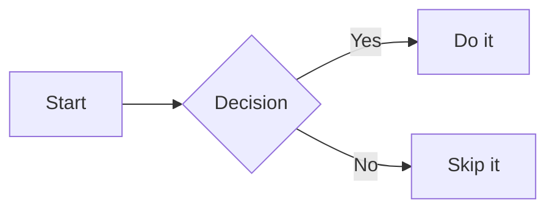

---

### Sequence Diagram

Shows interactions between actors over time — great for API flows, protocols, and call chains.

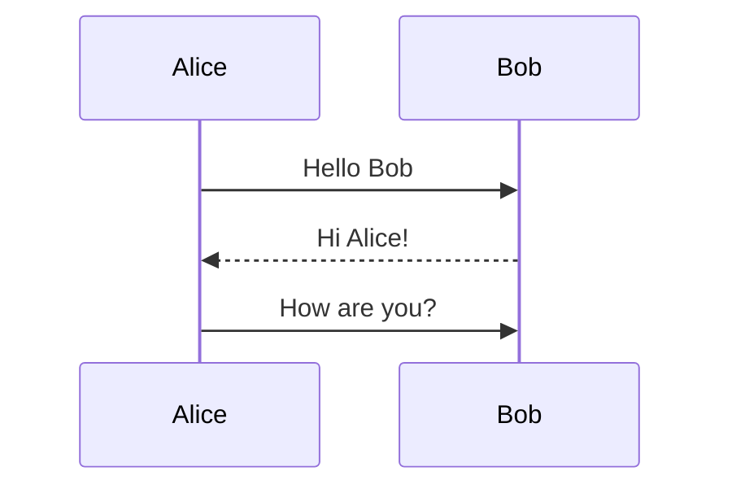

---

### Git Graph

Visualises a git branch and commit history.

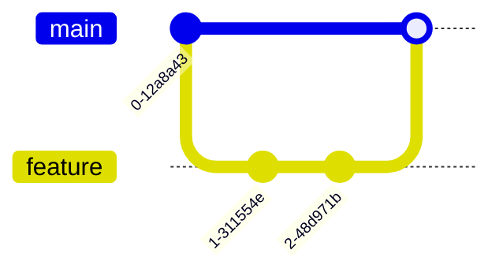

---

### Class Diagram

UML-style class relationships — inheritance, composition, associations.

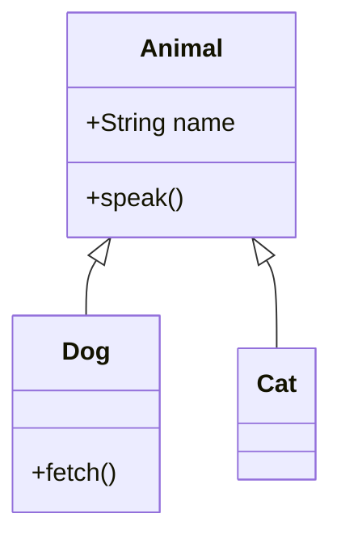

---

### State Diagram

Finite state machines and lifecycle flows.

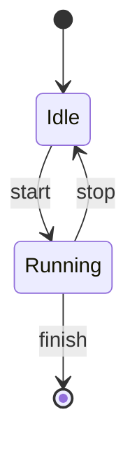

---

### Entity-Relationship Diagram

Database schema and entity relationships.

```mermaid
erDiagram
  USER ||--o{ ORDER : places
  ORDER ||--|{ LINE_ITEM : contains
  USER { string name, string email }
```

---

### Gantt Chart

Project timelines and schedules.

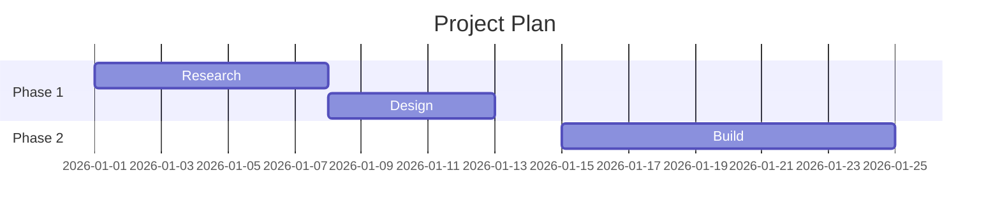

---

### Pie Chart

Simple proportional data.

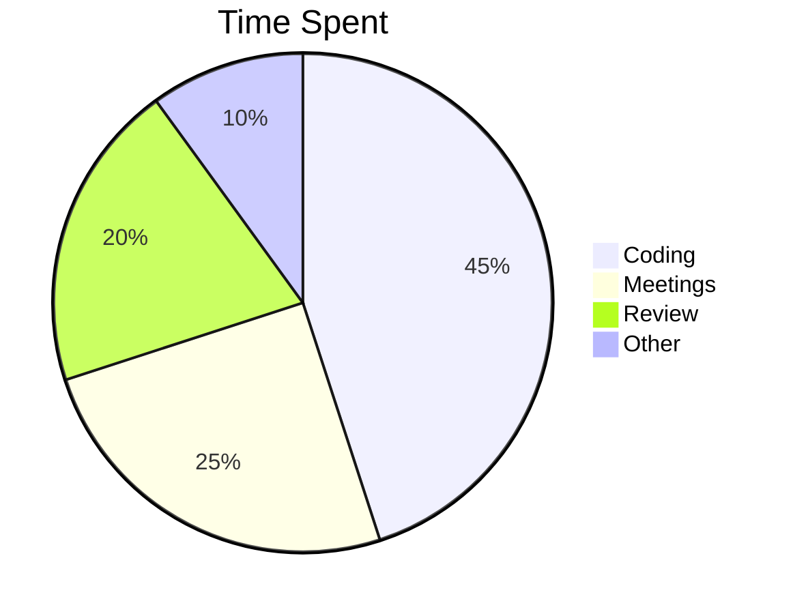

---

### User Journey

Maps steps in a user experience with satisfaction scores (1–5).

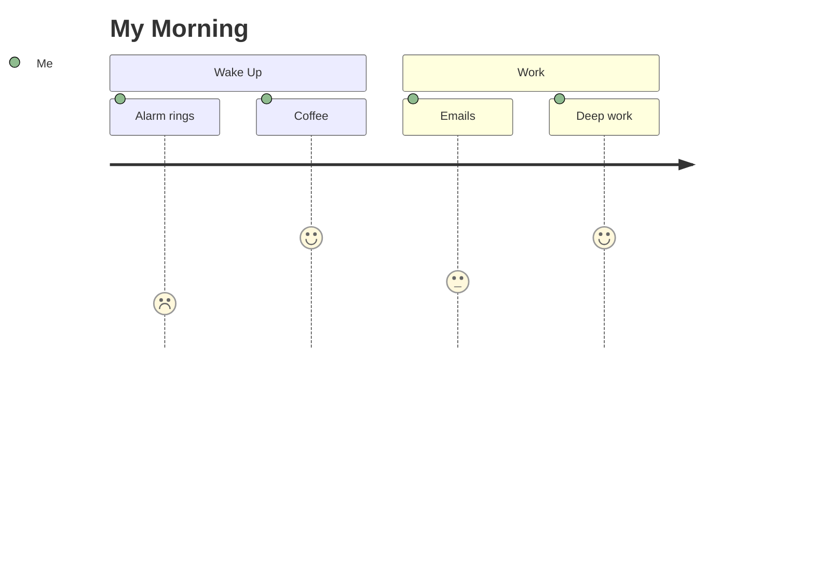

---

### Mindmap

Hierarchical tree of ideas radiating from a central topic.

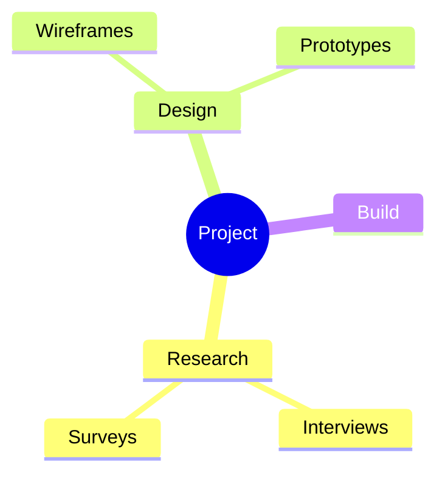

---

### Timeline

Chronological list of events by time period.

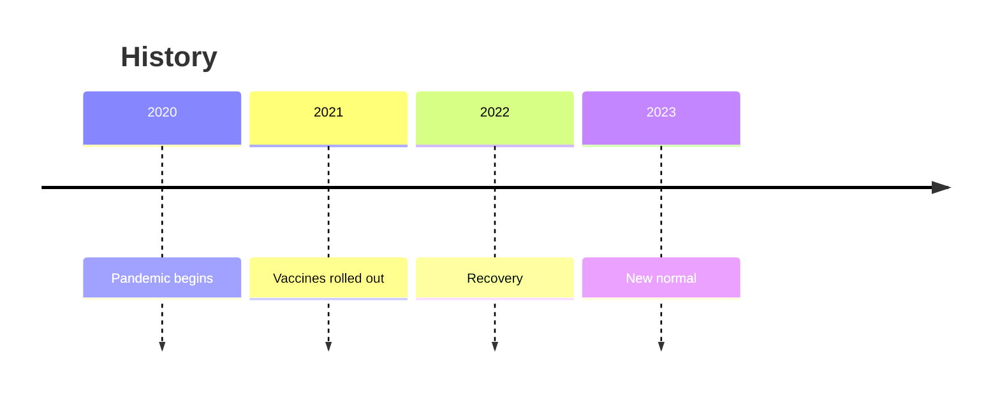

---

### C4 Diagram

Software architecture at different levels of abstraction (Context, Container, Component, Code).

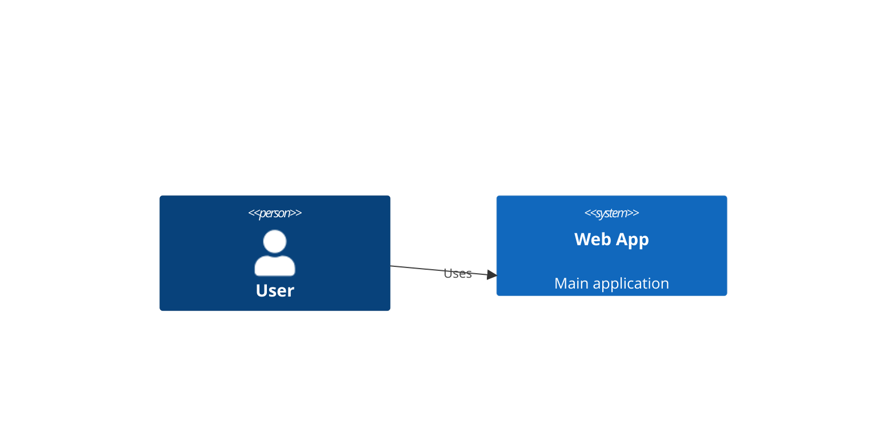

---

### Sankey Diagram *(beta)*

Flow volumes between nodes — energy, money, traffic.

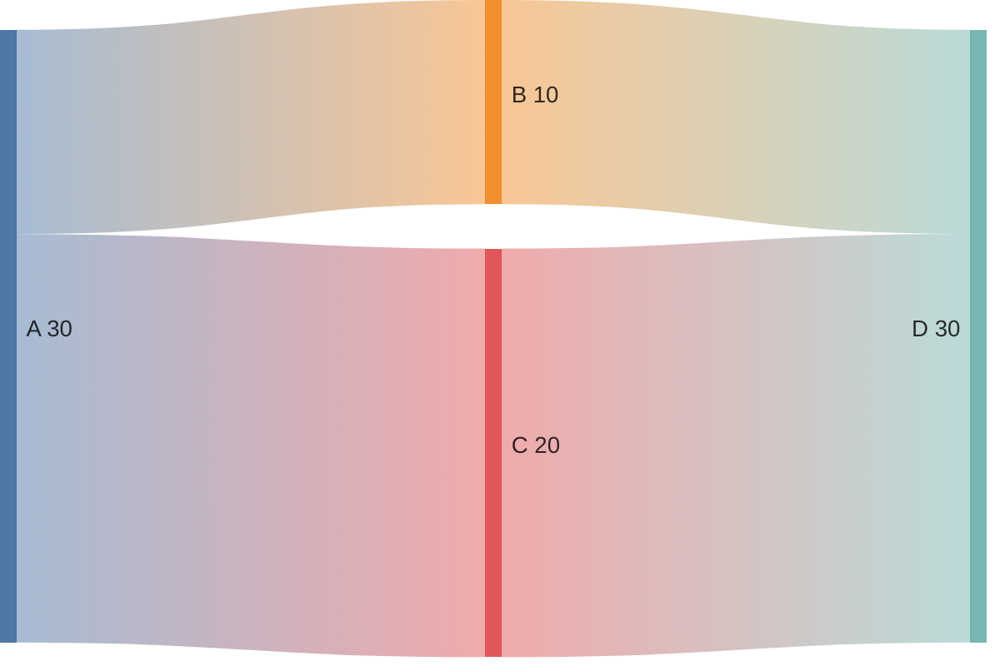

---

### XY Chart *(beta)*

Bar and line charts on an XY axis.

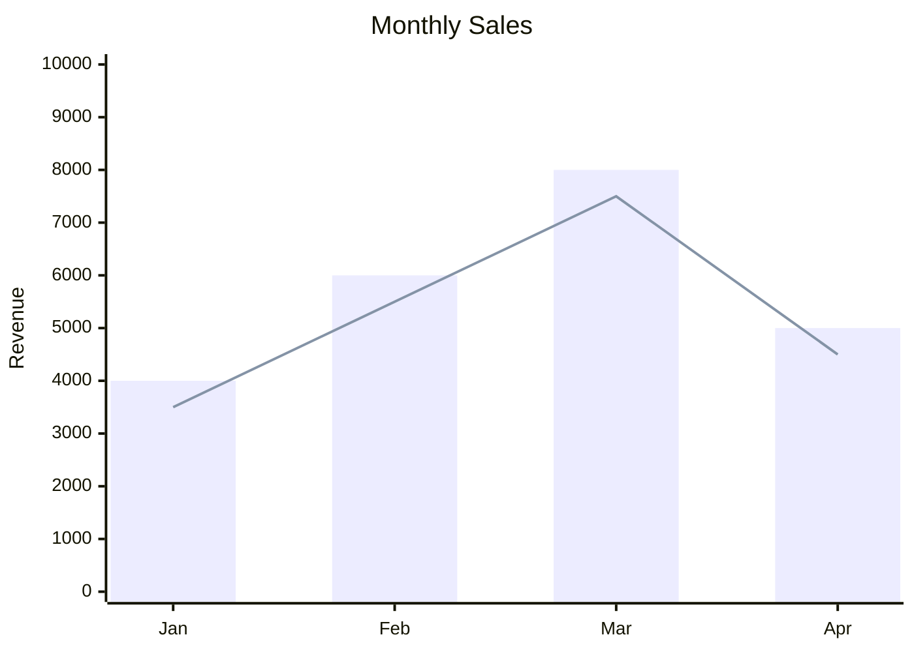

---

### Block Diagram *(beta)*

Flexible block-based layout for architecture and system diagrams.

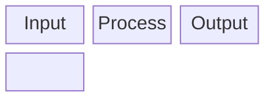

---

## Assets — Images & Attachments

Drag and drop or paste files directly into the editor:

- **Images** are saved and embedded as ``
- **Other files** are saved and linked as `[filename](assets/filename.pdf)`
- Files are stored in the `assets/` subfolder next to the note

### Orphan Asset Cleanup

In Nav Row 2, click the **broken-link icon** to scan `assets/` for files not referenced in any note. You can preview images and delete unused files from there.

---

## Search

Type **3 or more characters** in the search box to search across all notes in the workspace. Results display as clickable file cards with a highlighted snippet showing where the match occurred. Press `Escape` to clear search and return to the previous view.

---

## Calendar

Click the **calendar icon** to open the calendar view. Tasks with a Start, Due, or Completed Date appear as colored dots.

| Dot color | Meaning |
|---|---|
| Green | Start Date |
| Lavender | Completed Date |
| Red | Due Date |

- **← Prev / Next →** — Navigate months
- **Today** — Jump to current month
- Click a **day cell** or **task dot** to see a panel listing all tasks for that day
- Click a task in the panel to open it in the editor

### Calendar Filters

Toggle which dot types are shown with the checkboxes in the filter row: **Started**, **Completed**, **Due**.

---

## Archive

1. Open a note and click the **archive icon** in the editor toolbar → moves file to `archived/`
2. In Nav Row 2, click the **archive toggle** to browse archived files in the current folder
3. While viewing an archived file, click **Restore** in the toolbar to move it back to the active folder

Root-level notes are not archived. When **root** is selected, both the editor archive button and the Nav Row 2 archive toggle are hidden.

---

## Tasks

### Creating Tasks

- Create a note in a `tasks/` subfolder, **or**
- Open any note and click the **task icon** in the toolbar to convert it (moves the file to `tasks/`)

### Task Metadata

Priority, start date, due date, and completion date are encoded in the task filename. The **Task Date Bar** manages that metadata through date pickers, quick today actions for Start and Completed Date, and priority/status controls; you do not need to edit the filename format yourself. Each date has a visible calendar button, and a clear (×) button appears whenever that date has a value. The RecallStack calendar closes when you choose a day and also provides **Today**, **Clear**, and **Close** actions.

### Working Tasks

Use a Working Task for an active task you want to keep separate from the main Tasks list.

- In a task editor, click the **TASK** indicator to move the task into `tasks/working/`. It becomes **WORKING**; click that indicator to return it to `tasks/`.
- Working tasks are listed in the resizable **WORKING Tasks** pane while editing any task. The pane can show recently completed tasks and can be sorted alphabetically or by modification time.
- Use the layout button immediately to the left of **Show or Hide Working Tasks** to switch the pane between its bottom position and a left-side, three-pane layout. RecallStack remembers the selected layout, whether the Working Tasks pane is visible, and its resized dimensions across shutdowns.
- In the three-pane layout, drag either divider to resize **Working Tasks**, **Markdown**, or **Preview**. Each pane keeps a minimum width of 20% of the application window.
- Completing a Working Task automatically returns it to the main Tasks list.
- In the Tasks list, **Working Tasks** appears as the first section with a theme-aware peach accent. Select a task there to open it.
- The pane’s **Journal / Daily Notes** item opens today’s journal entry at `tasks/journal/YYYY/MM/`; a missing entry is created automatically and starts with the most recent journal content when available.
- Journal filenames are derived from the daily-note date and are read-only in the editor. Journal Markdown content remains fully editable.

Working Tasks remain editable and savable, but cannot be stamped, converted, copied, moved, archived, restored, or deleted until returned to the main Tasks list.

### All Tasks View

Click **All Tasks** in Nav Row 1 to see tasks from all workspaces grouped by top-level folder. Use the **✓ button** to show or hide completed tasks. Use the **grouping toggle** to switch between grouping by status/priority and grouping by folder.

---

## Themes

Theme preference is saved **per workspace**.

| Theme | Style |
|---|---|
| Catppuccin | Dark — cool purple tones *(default)* |
| Dracula | Dark — high contrast |
| Tokyo Night | Dark — cool blue tones |
| Rose Pine | Dark — warm mauve/rose tones |
| Kanagawa | Dark — Japanese ink palette |
| Citrus ☀ | Light — warm yellows |
| Watermelon ☀ | Light — pink/red |
| Peachy Sorbet ☀ | Light — peach |
| Berry Smoothie ☀ | Light — berry |
| Tropical Sherbet ☀ | Light — tropical |
| Citrus Fizz ☀ | Light — bright citrus |

---

## Desktop Requirements

Windows uses the Microsoft Edge WebView2 Evergreen Runtime normally supplied with supported Windows 10 and Windows 11 systems. Linux requires GTK 3 and WebKitGTK 4.1. RecallStack uses native Tauri filesystem commands; a separate browser is not required.

---

## Ownership and License

Copyright © 2026 Sam Chiang. All rights reserved.

RecallStack is publicly viewable source, not open-source software. No permission is granted to copy, modify, distribute, sublicense, or sell RecallStack except under a separate written agreement from the copyright holder. Third-party dependencies and bundled libraries remain subject to their respective licenses. See the `LICENSE` file distributed with RecallStack.
